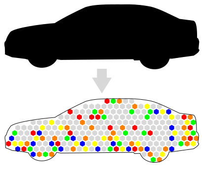

Decomposition
=============

Divide and conquer

User services make use of the functionality provided by a solution consisting of
a set of interacting technological elements. The overall architecture of such a
solution can therefore can be regarded as a composition of solution elements.

Following aspects indicate how to decompose the overall architecture into its
various elements:

* an element of the solution can be exchanged independently from the rest of the solution
* an element of the solution provides a specific functionality for other elements or users
* an element of the solution may have its individual lifecycle state

The result of the decomposition is map of individual technological elements
identifiable by unique identifiers within the administrative realm.
