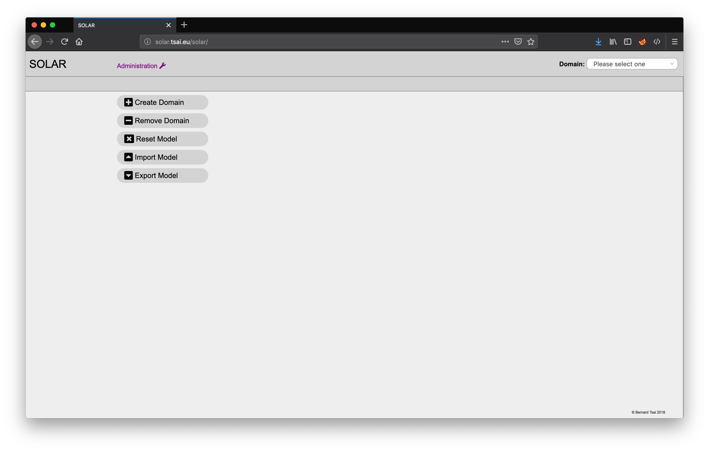
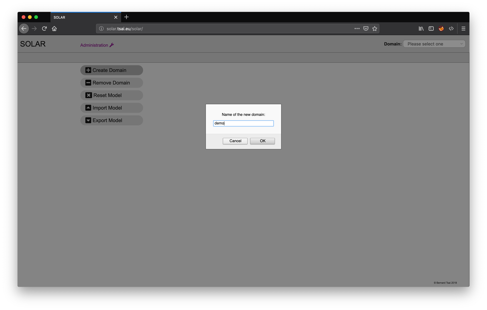

Administration
==============

SOLAR makes use of a central repository holding a model which is split up into several independent administrative domains.

The first step is therefore to create a domain for the example solution by opening the web interface of SOLAR (URL: http://localhost/solar/index.html).

The administration view of SOLAR will appear offering the possibility to conduct the following five administrative tasks:

1. **Create Domain:** allows to define a new administrative domain with an independent catalog and set of architecture blueprints and solutions,
2. **Remove Domain:** provides the possibility to completely remove a domain from the repository,
3. **Reset Model:** removes all domains from the repository,
4. **Import Model:** imports a repository by uploading the contents of a local file and
5. **Export Model:** exports a repository by downloading the contents of the repository into a file.

Clicking on "Create Domain" will prompt the user to enter the name of a new domain. For this example enter "demo" and press "OK".

A new domain with the name "demo" will be created and SOLAR will present the catalog view of the domain. A different domain can be selected at any time by picking one of the domains offered in the selection at top right of the navigation bar at the top of the screen.
