Architecture Design
===================

It is necessary to first model the blueprint of a solution in order to later automate the lifecycle management of its elements.

The catalog contains all the components serving as the potential building blocks of such a solution. A target architecture for a solution is designed by one by one adding components as solution elements to a solution and configuring them according to the environment specific considerations.

A solution element resembles a functional element of a specific component type providing a service which may evolve over time. A solution element may therefore consist of clusters - each representing a specific version of the component and holding a group of component instances of the same version.

Creating an architecture for a new solution
-------------------------------------------

The first step is to create a new solution by changing to the architecture view of SOLAR. This can be achieved by clicking on the "Architecture" icon on the top of the window.

Then press the "Create" button on the top right of the window to define the name of the solution for which an architectural blueprint should be designed.

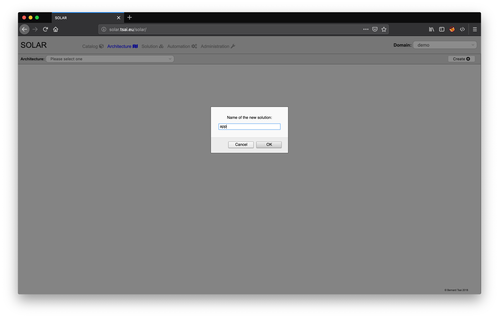

A prompt will appear asking for the name of the new solution. For this example enter "app" and press "OK".

The initial version of the architecture will be "V0.0.0" and not hold any elements as shown in the screenshot below.

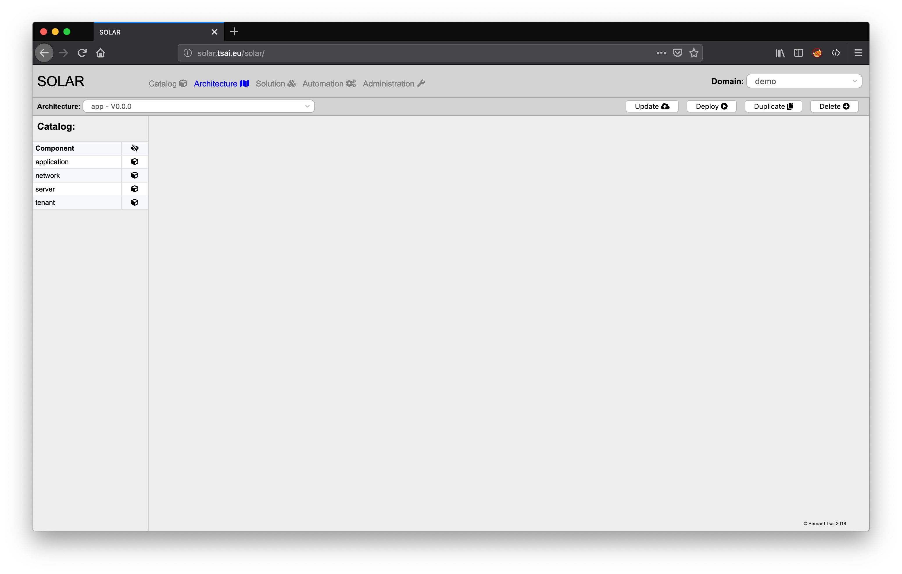

The architecture view of SOLAR will show the catalog components to the left and the architecture design on the right side. At the top right a set of buttons allow to update, deploy, duplicate and delete architectures as described later in this section.

The naming convention implies that the name of the architecture and the name of the solution need to be the same. It probably will become necessary to design several versions of the solution architecture to support the evolution of the solution and therefore each architecture will have a specific version tag following the naming conventions for versions (represented by a string starting with a 'V' and followed by a version number which complies with the rules for semantic versioning, e.g. V1.10.3)

In order to continue working on an existing architecture simply select an architecture from the options presented in the select box at the top left of the window.

Adding an architecture element
------------------------------

Solution elements can be added to the architecture by clicking on the "+" icon located right to the required component.

In order to create a "tenant" solution element click on "+" icon next to the tenant component. A prompt will appear asking which name the name tenant element should have.

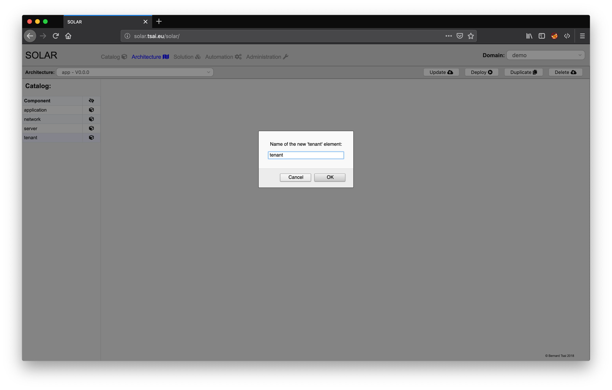

After entering "Tenant" and pressing OK a new element with the specified name and of selected component type is added to the architecture.

Editing an architecture element
-------------------------------

After having selected which component to add and assigning a name to the element a dialog for entering configuration information is presented:

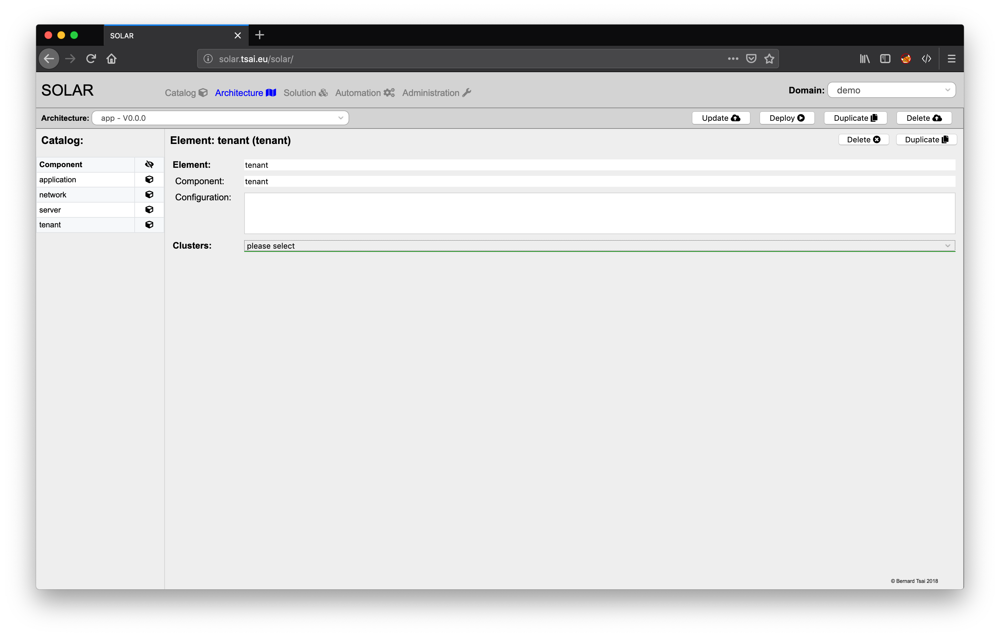

The name of the element and the component type of the element can not be changed anymore. The configuration field allows to enter information which relates to all versions of the solution element.

A solution element may need to support several version and therefore specific configurations for each version need to be taken into account. A dropdown box next to the "Clusters" label allows to select a version and then enter the corresponding cluster configuration information.

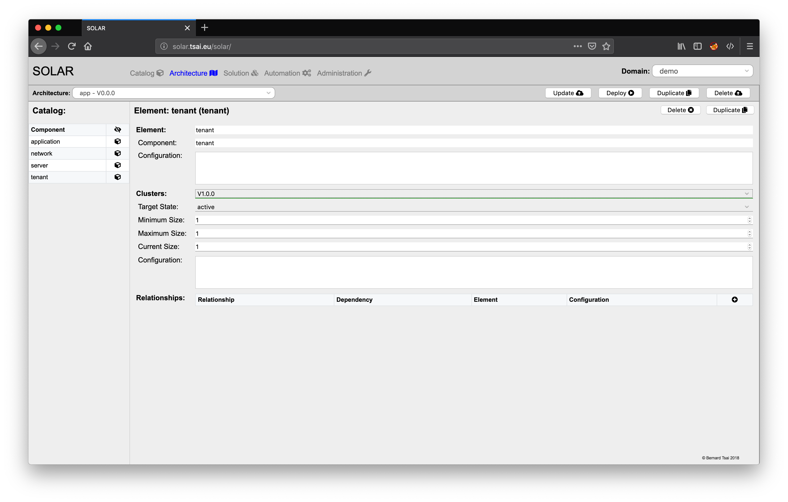

The main cluster specific configuration information relates to following attributes:

* the **target state** which describes which lifecycle state the instances of the cluster should have,
* the **minimum size** which states how many instances the cluster should at least have,
* the **maximum size** which states how many instances the cluster should at most have,
* the **current size** which states how many instances of the cluster should have the desired target state and
* the **configuration** which holds any cluster and component type specific configuration information for the element.

The "Tenant" solution element will not require any additional information and by clicking on "close" icon next to the "Component" headline of the catalog an overview of the currently presented architecture will be shown:

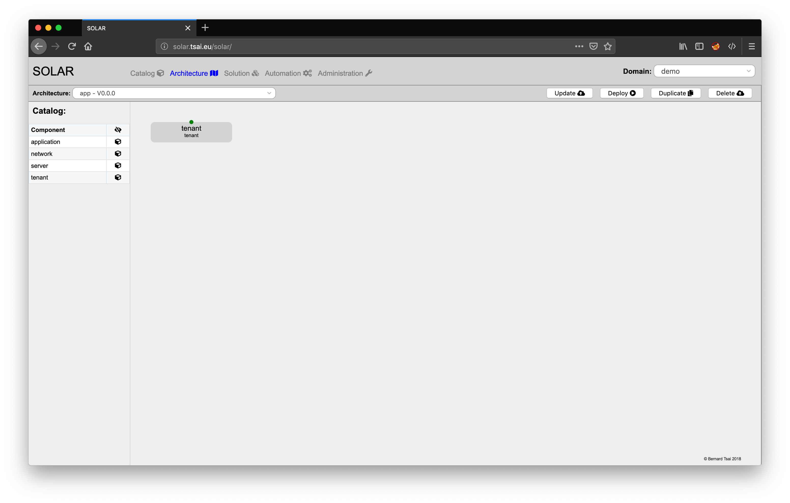

It depicts a single box referring to the new solution element "Tenant" of component type "tenant". The green dot on the top indicates that it exposes one cluster service interface which should be active.

The relationship details are of relevance when defining the "OAM" network element.  After adding a "network" element with the name "OAM" to the architecture and selecting the cluster "V1.0.0" add a new relationship to the cluster by pressing "+" icon located at the far right to the "Relationships" label.

A prompt appears asking for the name of the new relationship:

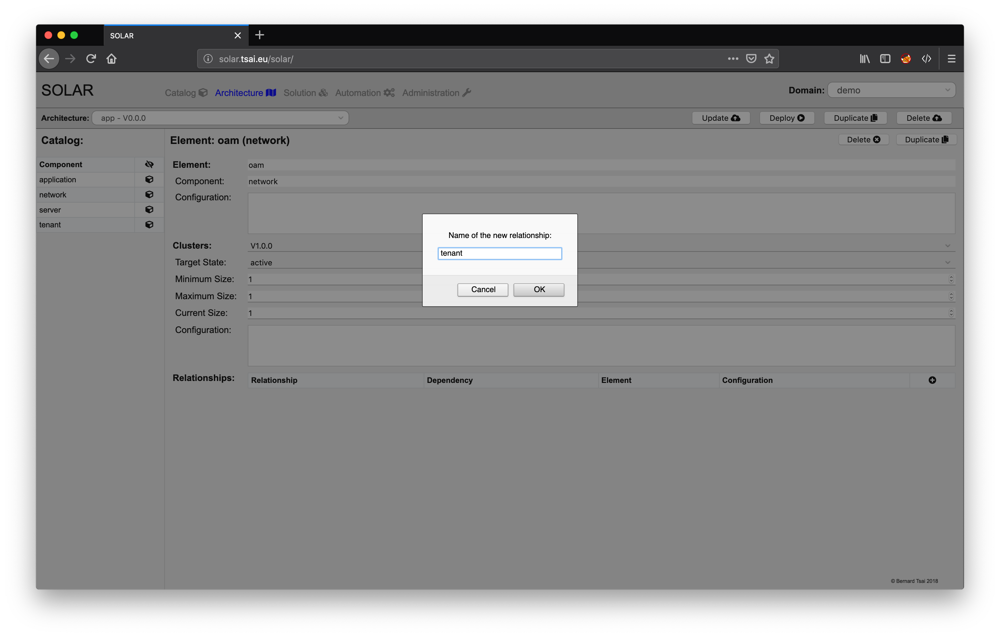

Entering "tenant" and pressing OK  will add a line to the relationships table. Specifying that "Dependency" should relate to the "Tenant" dependency of a "network" component and referring to the "Tenant" element of the solution by selecting it from the drop-down box and optionally entering configuration information for the relationship is what is needed to specify the relationship in detail:

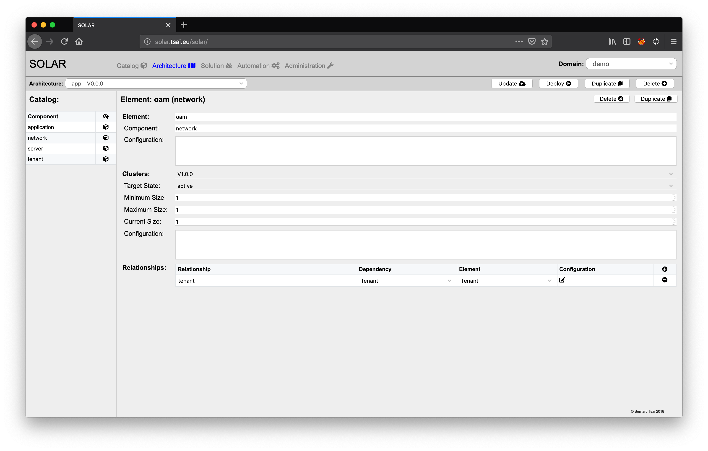

Changing back to the overview by pressing the "close" button next to the "Component" label of the catalog shows how the two components relate to one another:

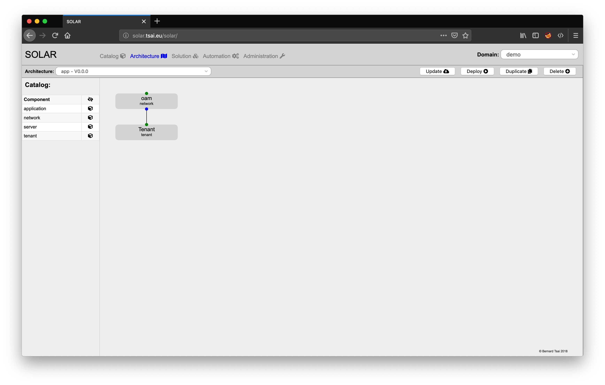

The solid line between the "oam" element and the "tenant" element indicates that there is runtime context dependency between these two entities.

Duplicating an architecture element
-----------------------------------

Elements can be duplicated in order to simplify the process of creating similar elements. After clicking on the "oam" element in the overview the dialog appears allowing to edit the element information. This dialog also exposes at the top right a button to duplicate this element. When clicking on the button a prompt appears asking for the name of the element:

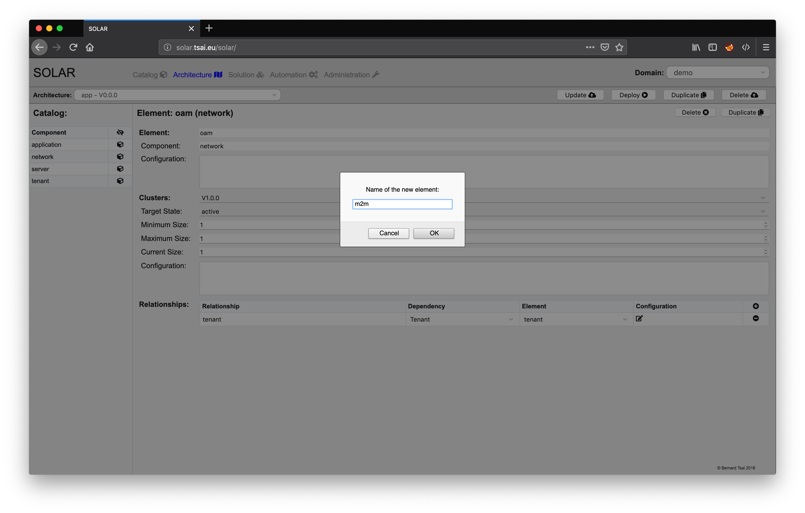

After entering "m2m" and pressing "OK" the dialog for editing the new "m2m" element appears in which all of the attributes of the "oam" element have been copied apart from the name. Switching back to the overview displays how the new element fits into the architectural overview.

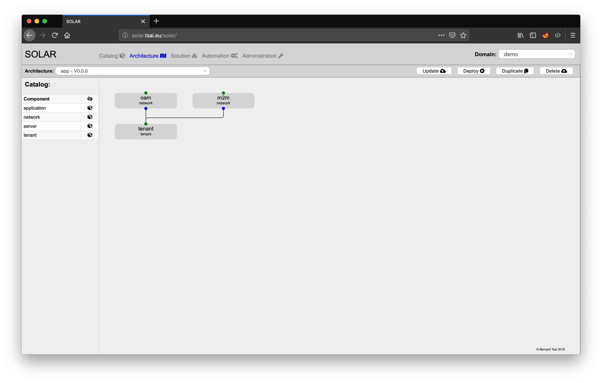

Deleting an architecture element
--------------------------------

Removing an element from the architecture is achieved is by selecting an element from the overview and pressing on the "Delete" button located at the top right of the dialog.

Updating an architecture
------------------------

It is essential to upload the architecture definition to the repository after having added and configured all the required elements:

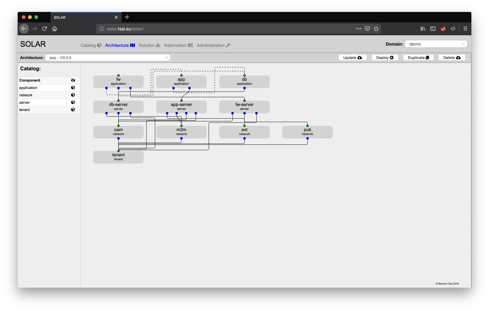

This is achieved by pressing the "Update" button at the top right of the window (architectures should not be updated as soon as they have been deployed in order to avoid inconsistencies).

Duplicating an architecture
---------------------------

The architecture of a solution needs to evolve. SOLAR therefore offers the possibility to make a copy of the architecture and assigning it a new version tag by pressing the "Duplicate" button located at the top right of the window.

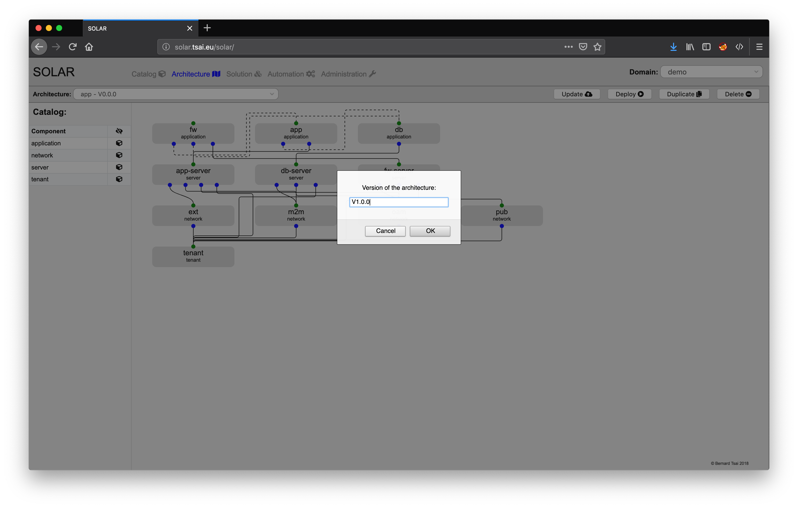

A prompt will appear asking for the version identifier and the architecture overview will present the newly created copy of the architecture.

Deleting an architecture
------------------------

Architectures which are not needed any longer can be easily removed by first selecting the appropriate architecture and then pressing the "Delete" button at the top right of the window.

Deploying an architecture
-------------------------

An architecture defines the target picture of a solution. This may differ from the current state a solution may have. SOLAR offers the possibilities to automatically derive the required transactions in order to converge the current state to the target state defined by an architecture.

For this purpose it is necessary to first select the desired version of the architecture and then press the "Deploy" button located at the top right of the window.

This triggers the closed-loop deployment process. The view will switch to the solution view which will be explained in the following section. 
