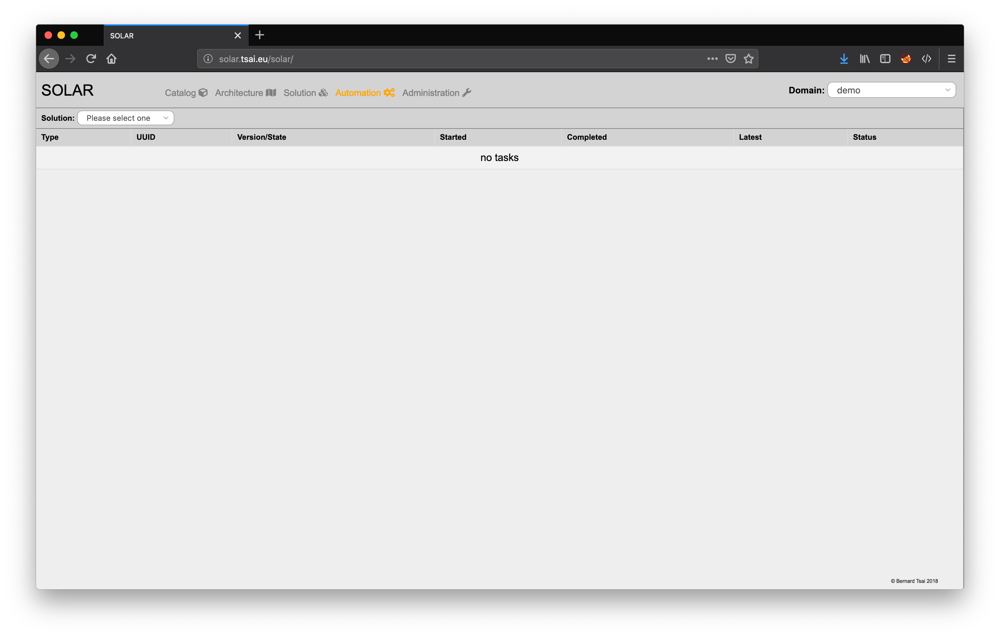
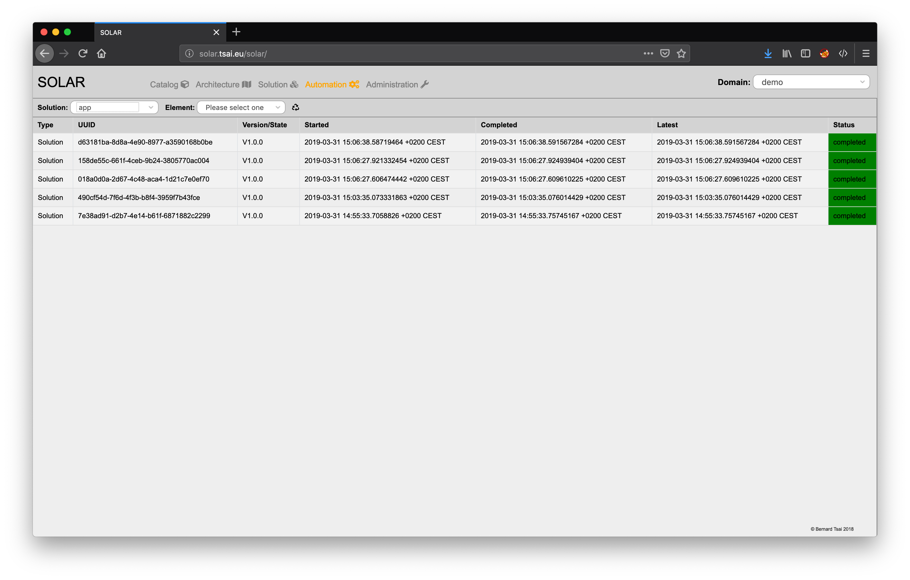
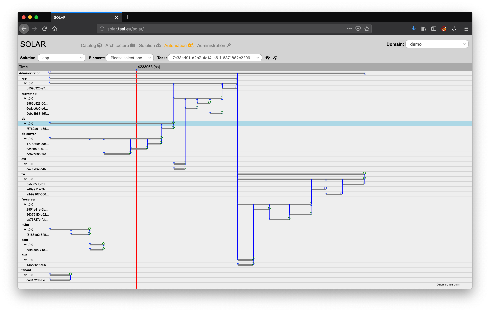

Automation Control
==================

The closed-loop algorithm initiates a vast set of tasks in order to converge the current state of the solution towards a desired target state. These tasks may relate to:

* the solution level or
* the element level or
* the cluster level or
* the instance level

of the solution. Tasks may trigger a hierarchy of required subtasks and are executed until either:

* the task terminates successfully or
* the task fails or
* the task runs into a timeout or
* the task has been terminated by DevOps intervention.

Events relate to these situations tasks and may trigger subsequent tasks.

The automation control view of SOLAR can be selected by clicking on the "Automation" button at the top of the window.

Filtering Automation Tasks
--------------------------

The automation control view allows to identify the relevant tasks by successively drilling down to the level of entities for which the relevant tasks should be listed:

This is achieved by selecting the specific solution, solution element, cluster and instance with the help of drop-down fields located at the top of the window.

The list of tasks are presented in chronological order with the latest initiated tasks listed first exposing:

* the type of the task,
* the UUID of the task,
* the desired architecture version or instance state,
* the time the task was started
* the time the time has been completed
* the last known event related to the task and
* the status of the task .

The list can be refreshed by pressing on the "Refresh" button.

Displaying an Automation Task
-----------------------------

Clicking on a task item in the task list displays the task flow with the help of a graphical representation:

The graph displays the affected entities (elements/clusters and instances) as horizontal swimlanes containing the related tasks. The events exchanged between the tasks a depicted as vertical lines originating from the source task and directed to the task which is to be informed about the event. A red vertical cursor allows to determine the time at which a certain event has occurred.

Clicking on a swimlane opens the solution view and focuses on the corresponding solution element.

The view can be refreshed by pressing on the "Refresh" button and closed by clicking on the "Close" button next to it.
