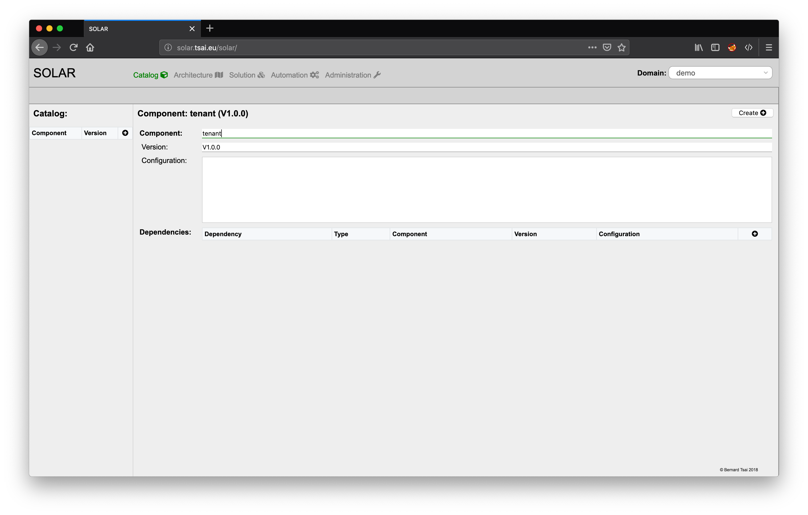
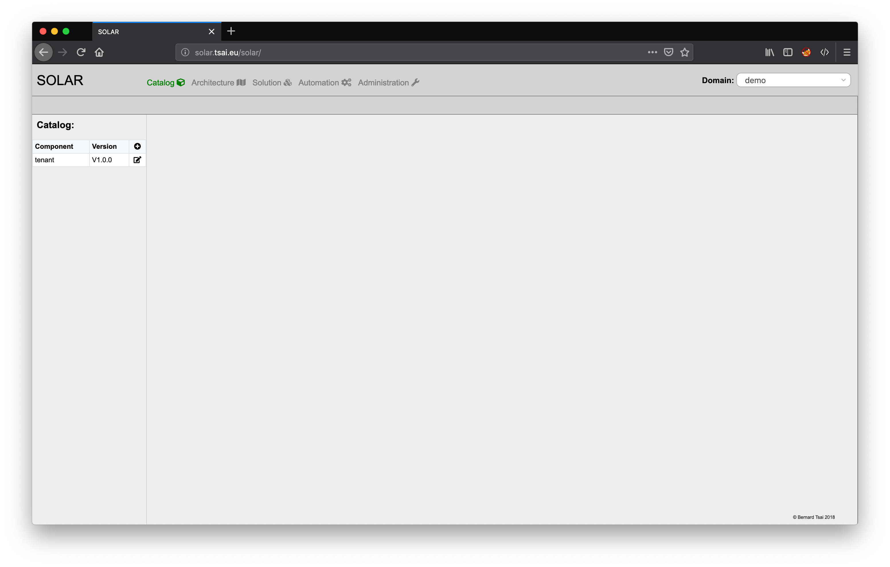
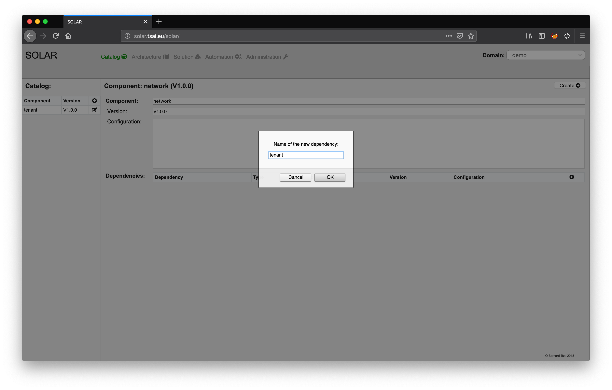
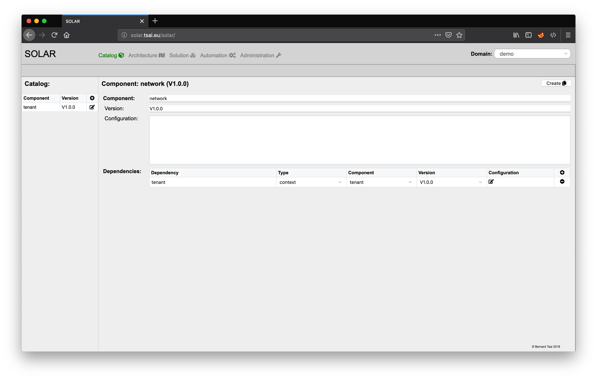
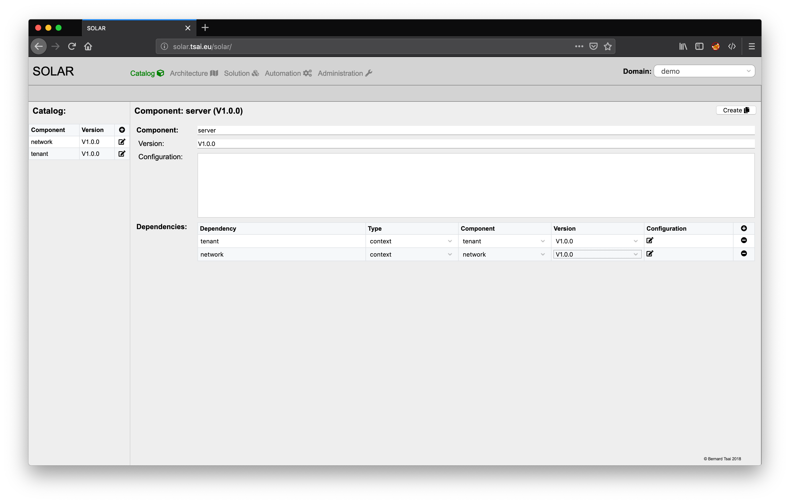
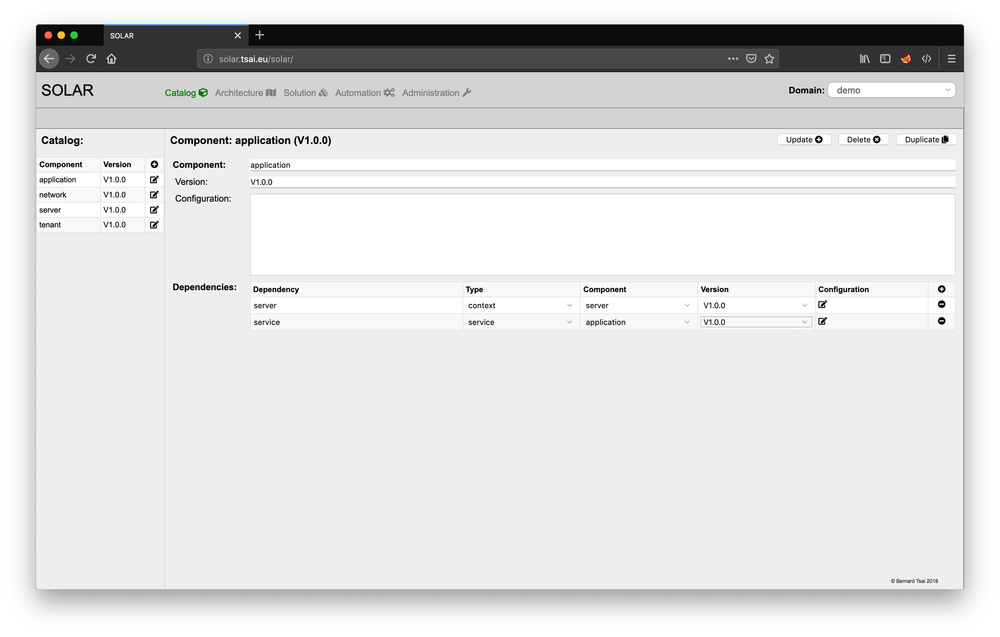

Catalog Management
==================

The catalog view allows to define the components which may serve as the building blocks for solutions. It can be selected by clicking on the catalog icon in the navigation bar at the top of the screen. Initially the catalog is empty.

This example requires four types of components:

1. a **tenant** representing a virtual datacenter containing servers and networks
2. a **network** representing a communication domain via which servers and/or external communication partners can communicate with one another
3. a **server** which will host applications and which is connected to networks
4. an **application** representing software processes which are deployed to servers and may depend on the services exposed by other hosts.

The components will be listed on the left side of the window whereas details of a component will be presented on the right side of the screen.

Creating a new component
------------------------

Pressing the "+" button on the left side will open the detail view for a new component. Initially the attributes of the new component are set to default values and need to be redefined.

The main attributes for a component are:

* the **name** of the component (this corresponds to the type of a solution instance),
* the **version** represented by a string starting with a 'V' and followed by a version number which complies with the rules for semantic versioning (e.g. V1.10.3) and
* a **base configuration**, which can be a component specific configuration string.

The screenshot below displays the information of a "tenant" component:

The component is added to the catalog by pressing the "Create" button on the top right of the details view.

The components which have been stored in the catalog appear on the left side of the screen.

A "network" component can be defined in the similar way. It is assumed that a "network" has a runtime context dependency to a "tenant", i.e. it can only be created within the context of a tenant.

A new dependency is added by clicking on the "+" icon on the right of the dependencies list which is initially empty. A prompt will appear asking for the name of the dependency.

Each dependency is described by:
* the **type** of dependency (runtime context or service context),
* the **component** type which can fulfil the dependency,
* the required **version** of the component type and
* an optional dependency specific **base configuration**.

Dependencies which are not needed can be removed by pressing the "-" icon to the left of each dependency.

It is important to note that changes to the repository will only be made if the "Create" button is pressed.

The following screenshots display the definition for the "server" component. The assumption is that "servers" require a "tenant" and "networks" as their runtime context.

Updating a component
--------------------

"Applications" require "servers" as their runtime context and other "applications" as their service context. Since the "application" component has a self-referential service dependency to itself it is necessary to first create the component without this dependency and then later update the component by adding the missing dependency. This can be achieved by pressing the icon to the left of a component in the list, which will open the details view for the component again.

The changes made will only be synchronised with the repository after pressing the "Update" button on the top right of the details view. It is recommended to not change a component definition after having referred to it in the context of dependencies or architecture blueprints.

Duplicating a component
-----------------------

In some cases it might be helpful to make a copy of an existing component definition without having to reenter all the information, e.g. when creating a new version of a component definition. The detail view of a component offers a "Duplicate" button for this purpose, which when pressed copies the definitions of the component and updates the minor number of the version indicator. The "Update" button will allow to then persist any required modifications.

Deleting a component
--------------------

The "Delete" button of the component detail view allows to remove the component definition from the repository in the case this definition is not required any longer.

At this point all required components have been defined and can now be used for designing an architecture which will serve as a solution blueprint.
