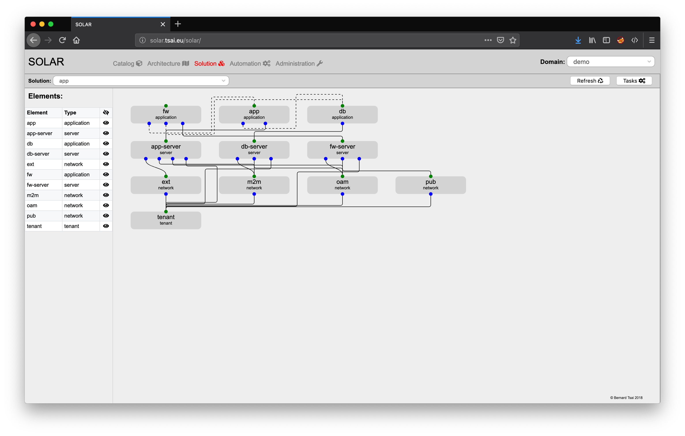
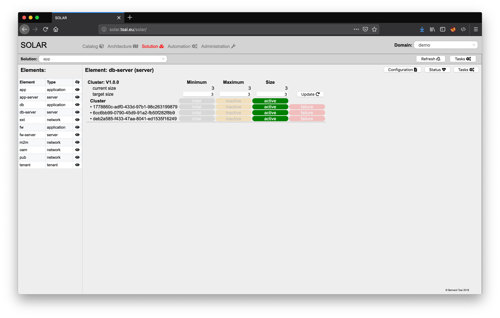
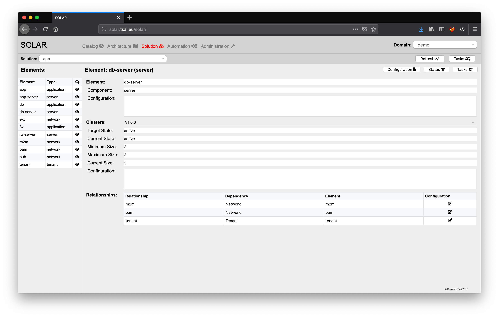

Solution Management
===================

Managing a solution requires obtaining an overview of the current state of a solution and all of its solution elements. The solution management view can be selected by clicking on the "Solution" button at the top of the window.

Selecting a Solution
-------------------

There may be several solutions within a domain. To select a specific solution pick a solution from the drop-down box located at the top left of the window.

The overview displays on the left side the elements of the solution as a table. The right side displays the architecture in a graphical representation which displays a box for each element. The labels within each box state the name of the element and to which type of component the solution element belongs. The circles at the top of each box relate to the status of each cluster of the solution element:

* **grey:** initial state
* **yellow:** inactive state
* **green:** active state
* **red:** failure state

The circles at the bottom relate to the various relationships the solution elements may have to other solution elements. These relationships are depicted as solid or dashed lines. Solid lines relate to runtime context dependencies whereas service context dependencies are shown as dashed lines.

The view can be refreshed by pressing the "Refresh" button at the top right of the window.

View the Tasks Related to a Solution
------------------------------------  

Tasks may be associated with the creation, modification or deletion of a solution. An overview of all the tasks related to the specific solution are is obtained by pressing the "Tasks" button at the top right of the window.

Display the Status of a Solution Element
----------------------------------------

In order to display the status of a single solution element either press on the icon right to element listed on the left side of the window or click on one of the solution elements:

The status of the solution element display the current sizing of the clusters and the status of each cluster instance.

Pressing the "Close" button on the top right of the element list closes the detail view and changes the view back to the solution overview.

Display the Configuration of a Solution Element
-----------------------------------------------

The current configuration of a solution element is displayed after pressing the "Configuration" button at the top right of the dialog.

By pressing the "Status" button the view is changed back to the status view of the solution element.

View the Tasks Related to a Solution Element
--------------------------------------------  

Tasks may be associated with the scaling of cluster and the lifecycle management of instances of solution elements. An overview of all the tasks related to the specific solution are is obtained by pressing the "Tasks" button at the top right of the dialog.

Administrate the Lifecycle of a Solution Element
------------------------------------------------

The desired target state of a instances of a cluster or of single instances of a cluster may be adjusted by clicking on the corresponding buttons. The task may take some time and therefore it is recommended to click on the refresh button to verify that the changes have been applied as desired.

Some changes may not be applicable since they would violate scaling rules (e.g. deactivating an instance of cluster where all cluster instances need to be active)

Scale a Solution Element
------------------------

The status view allows to adjust the scaling of a cluster by modifying the target size parameters of the cluster and pressing the corresponding update button. The task may take some time and therefore it is recommended to click on the refresh button to verify that the changes have been applied as desired.
