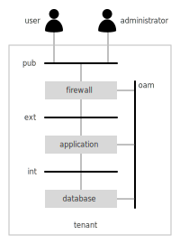

Demo
====

SOLAR provides a reference implementation of the concepts presented in this document. As such it does not manage actual resources and solution elements but rather simulates the administration procedures in order to serve as a proof-of-concept.

An example will help to demonstrate the capabilities of the orchestrated lifecycle management approach of SOLAR. In this example a simple application server hosted together with a database backend in a tenant is providing it's service via a firewall to users in the internet as shown in the diagram below.

The solution makes use of four networks for establishing communication amongst the applications, the users and administrators according to following considerations:

* users can access the application services from the internet (pub) via the firewall
* administrators can manage the firewall, the application server and the database from the internet (pub) via the firewall
* the firewall forwards external user requests via the machine-to-machine network (ext)
* the firewall forwards external administrative requests via the operation, administration and maintenance network (oam)
* the application server persists its information to the database via the machine-to-machine network (int)

All applications need to be hosted on their corresponding servers which belong together with the networks listed above to a tenant context.

The following sections explain how to make use of the SOLAR system in order to handle the tasks listed below:

* **Administration:** i.e. how to setup and manage domains representing independent administrative realms with their corresponding catalog, architectures and solutions.
* **Catalog Management:** describing how to define and manage components which will serve as the building blocks for a solution
* **Architecture Design:** covers the steps in order to define a blueprint for solutions which can then later be deployed automatically
* **Solution Management:** explains how to obtain an overview of the status of a solution and conduct simple operational tasks such as scaling clusters or changing the lifecycle state of individual instances of solution elements.
* **Automation Control:** allows to visualise and manage the flow of activities related to automated change procedures.
